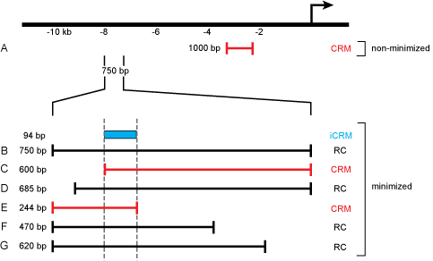
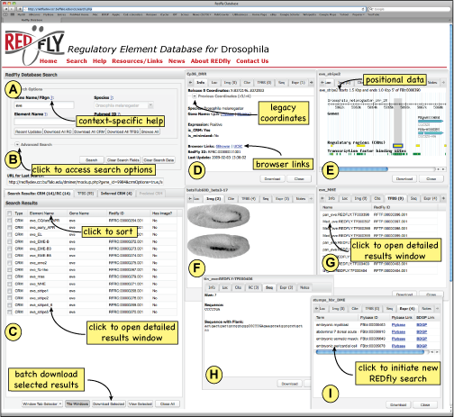
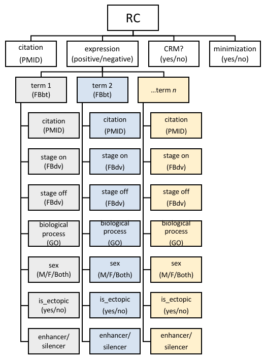

# Figures

## Figure 1

Reporter Constructs and their attributes in _**RED**fly_. The figure illustrates a hypothetical locus for which seven different reporter constructs (A-G) have been tested in vivo. Construct A is a 1 kb sequence fragment located roughly 2 kb upstream of the transcription start. Because it is an isolated construct, it is considered to be a CRM that has not been subject to minimization. If this construct showed reporter gene activity, it would be designated as “expression positive”; otherwise it would be labeled “expression negative.” Constructs B-G are part of an overlapping and partially nested series of sequences spanning 750 bp of DNA 7.25 kb upstream of the transcription start. In this example, each drives the identical pattern of reporter gene expression. Because each of these constructs overlaps at least one other, we consider this region and the six constructs to have undergone minimization. Constructs C and E are each the shortest of a respective set of nested sequences and are therefore considered to be CRMs (marked in red). The remaining constructs are designated as RCs (black). A 94 bp sequence marks the minimal region of overlap among all of the constructs and is thus registered in _**RED**fly_ as an inferred CRM (iCRM, blue). If more than one iCRM is calculated with the same coordinates, but different expression terms, these will be merged into a single iCRM that includes the union of the expression terms.

## Figure 2

The _**RED**fly_ user interface. See text for details. Search options (A, B), results overview (C), and detailed results (D-I) are all displayed within a single web browser window. (D-I) Detailed results are displayed as individual floating windows that can be stacked or tiled as desired; on a large monitor, a dozen or more individual records can be fully tiled for simultaneous viewing.

## Figure 3 

